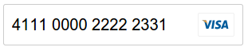

# &lt;input-creditcard&gt;

> CreditCard component which format your number and show the type of card using [Polymer](http://www.polymer-project.org/).

> Supported cards: American Express, Maestro, JCB, Master Card, Visa, Diners Club, Discover, Dankort, Laser, UnionPay

## Example



## Install

Install the component using [Bower](http://bower.io/):

```sh
bower install polymer-input-creditcard --save
```

Or [download as ZIP](https://github.com/mutebg/polymer-input-creditcard/archive/master.zip).

## Usage

1. Import Web Components' polyfill:

    ```html
    <script src="bower_components/webcomponentsjs/webcomponents.min.js"></script>
    ```

2. Import Custom Element:

    ```html
    <link rel="import" href="bower_components/input-creditcard/input-creditcard.html">
    ```

3. Start using it!

    ```html
    <input-creditcard></input-creditcard>
    ```

## Options

Attribute       | Options       | Default       | Description
---             | ---           | ---           | ---
`name`          | *string*      | none          | Input name.
`value`         | *string*      | none          | Input value.
`placeholder`   | *string*      | none          | Input placeholder.
`disabled`      | *boolean*     | false         | Disabled input.
`readonly`      | *boolean*     | false         | Input is readonly.
`required`      | *boolean*     | false         | Input is required.
`valid`      	| *boolean*     | false         | Validate credit card number.
`errorClassName`| *string*     	| error         | Default validate error class

## Methods

Method        	| Parameters   | Returns    | Description
---           	| ---          | ---        | ---
`isValid()`   	| None.        | *boolean* 	| Return true if credit card number is valid.
`getCardType()`	| None.        | *string*   | Return type name of credit card.

## Contributing

1. Fork it!
2. Create your feature branch: `git checkout -b my-new-feature`
3. Commit your changes: `git commit -m 'Add some feature'`
4. Push to the branch: `git push origin my-new-feature`
5. Submit a pull request :D

## History

For detailed changelog, check [Releases](https://github.com/mutebg/polymer-input-creditcard/releases).

## License

[MIT License](http://opensource.org/licenses/MIT)